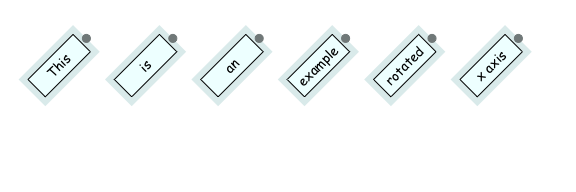
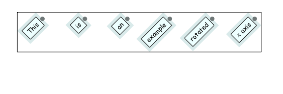
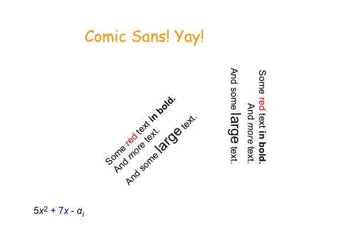
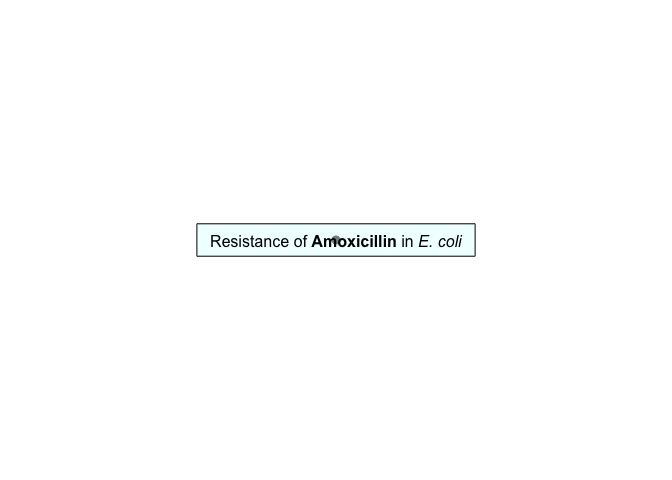
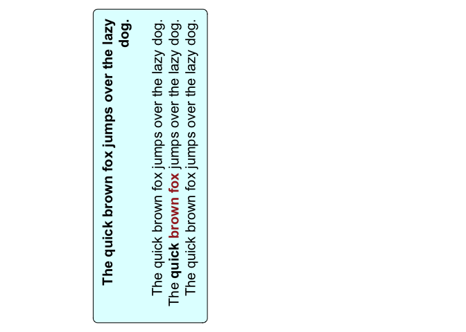

<!-- README.md is generated from README.Rmd. Please edit that file -->

gridtext
========

<!-- badges: start -->

<!-- badges: end -->

Improved text rendering support for grid graphics in R.

Installation
------------

You can install the current release from CRAN with `install.packages()`:

    install.packages("gridtext")

To install the latest development version of this package, please run
the following line in your R console:

    remotes::install_github("wilkelab/gridtext")

Examples
--------

The gridtext package provides two new grobs, `richtext_grob()` and
`textbox_grob()`, which support drawing of formatted text labels and
formatted text boxes, respectively. Both grobs understand an extremely
limited subset of Markdown, HTML, and CSS directives. The idea is to
provide a minimally useful subset of features. These currently include
italics, bold, super- and subscript, as well as changing text color,
font, and font size via inline CSS. Extremely limited support for images
is also provided.

Note that all text rendering is performed through a custom-built
rendering pipeline that is part of the gridtext package. This approach
has several advantages, including minimal dependencies, good
performance, and compatibility with all R graphics devices (to the
extent that the graphics devices support the fonts you want to use). The
downside of this approach is the severely limited feature set. Don’t
expect this package to support the fancy CSS and javascript tricks
you’re used to when designing web pages.

### Richtext grob

The function `richtext_grob()` serves as a replacement for `textGrob()`.
It is vectorized and can draw multiple text labels with one call. Labels
can be drawn with padding, margins, and at arbitrary angles. Markdown
and HTML parsing is turned on by default.

    library(grid)
    library(gridtext)

    text <- c(
      "Some text **in bold.**",
      "Linebreaks Linebreaks Linebreaks",
      "*x*2 + 5*x* + *C**i*",
      "Some blue text **in bold.** And *italics text.* And some large text."
    )

    x <- c(.2, .1, .7, .9)
    y <- c(.8, .4, .1, .5)
    rot <- c(0, 0, 45, -45)
    gp = gpar(
      col = c("black", "red"),
      fontfamily = c("Palatino", "Courier", "Times", "Helvetica")
    )
    box_gp = gpar(
      col = "black", fill = c(NA, "cornsilk", "lightblue1", NA),
      lty = c(0, 1, 1, 1)
    )
    hjust <- c(0.5, 0, 0, 1)
    vjust <- c(0.5, 1, 0, 0.5)

    grid.newpage()
    g <- richtext_grob(
      text, x, y, hjust = hjust, vjust = vjust, rot = rot, 
      padding = unit(c(6, 6, 4, 6), "pt"),
      r = unit(c(0, 2, 4, 8), "pt"),
      gp = gp, box_gp = box_gp
    )
    grid.draw(g)
    grid.points(x, y, default.units = "npc", pch = 19, size = unit(5, "pt"))

<!-- -->

The boxes around text labels can be set to have matching widths and/or
heights, and alignment of text inside the box (specified via `hjust` and
`vjust`) is separate from alignment of the box relative to a reference
point (specified via `box_hjust` and `box_vjust`).

    text <- c("January", "February", "March", "April", "May")
    x <- (1:5)/6 + 1/24
    y <- rep(0.8, 5)
    g <- richtext_grob(
      text, x, y, halign = 0, hjust = 1,
      rot = 45,
      padding = unit(c(3, 6, 1, 3), "pt"),
      r = unit(4, "pt"),
      align_widths = TRUE,
      box_gp = gpar(col = "black", fill = "cornsilk")
    )
    grid.newpage()
    grid.draw(g)
    grid.points(x, y, default.units = "npc", pch = 19, size = unit(5, "pt"))

<!-- -->

Basic support for images is available as well. As of now, images will
always be vertically aligned with the baseline of the text.

    grid.newpage()

    img_src <- system.file("extdata", "Rlogo.png", package = "gridtext")
    text <- glue::glue("Image with native aspect ratio:  And some more text.")
    grid.draw(richtext_grob(text, x = 0.9, y = 0.7, hjust = 1))

    text <- glue::glue("Image with forced size:  And some more text.")
    grid.draw(richtext_grob(text, x = 0.9, y = 0.3, hjust = 1))

<!-- -->

### Textbox grob

The function `textbox_grob()` is intended to render multi-line text
labels that require automatic word wrapping. It is similar to
`richtext_grob()`, but there are a few important differences. First,
while `richtext_grob()` is vectorized, `textbox_grob()` is not. It can
draw only a single text box at a time. Second, `textbox_grob()` doesn’t
support rendering the text box at arbitrary angles. Only four different
orientations are supported, corresponding to a rotation by 0, 90, 180,
and 270 degrees.

    g <- textbox_grob(
      "**The quick brown fox jumps over the lazy dog.**  
      The quick brown fox jumps over the lazy dog.
      The **quick brown fox** jumps over the lazy dog.
      The quick brown fox jumps over the lazy dog.",
      x = unit(0.5, "npc"), y = unit(0.7, "npc"),
      gp = gpar(fontsize = 15),
      box_gp = gpar(col = "black", fill = "lightcyan1"),
      r = unit(5, "pt"),
      padding = unit(c(10, 10, 10, 10), "pt"),
      margin = unit(c(0, 10, 0, 10), "pt")
    )
    grid.newpage()
    grid.draw(g)

<!-- -->

The alignment parameters `hjust`, `vjust`, `halign`, and `valign`
function just like they do in `richtext_grob()`.

    g <- textbox_grob(
      "**The quick brown fox jumps over the lazy dog.**  
      The quick brown fox jumps over the lazy dog.
      The **quick brown fox** jumps over the lazy dog.
      The quick brown fox jumps over the lazy dog.",
      x = unit(0.2, "npc"), y = unit(0.5, "npc"),
      hjust = 0.5, vjust = 1, halign = 1,
      gp = gpar(fontsize = 15),
      box_gp = gpar(col = "black", fill = "lightcyan1"),
      r = unit(5, "pt"),
      padding = unit(c(10, 10, 10, 10), "pt"),
      margin = unit(c(0, 10, 0, 10), "pt"),
      orientation = "left-rotated"
    )
    grid.newpage()
    grid.draw(g)

<!-- -->

Acknowledgments
---------------

This project is receiving [financial
support](https://www.r-consortium.org/projects/awarded-projects) from
the [R consortium.](https://www.r-consortium.org)

