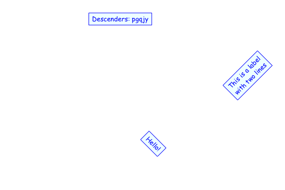

<!-- README.md is generated from README.Rmd. Please edit that file -->

# gridtext

[](https://cran.r-project.org/package=gridtext)
[](https://travis-ci.org/clauswilke/gridtext)
[](https://codecov.io/github/clauswilke/gridtext?branch=master)

Improved text rendering support for grid graphics in R, written by Claus
O. Wilke

**Disclaimer:** This is a work in progress. The API is not stable.
Please do not use this in any context where you need your code to work.
No user support will be provided.

## Installation

``` r
devtools::install_github("clauswilke/gridtext")
```

## Examples

### Rich-text grob

The function `rich_text_grob()` serves as a replacement for
`textGrob()`. It is vectorized and can draw multiple text labels with
one call. Labels can be drawn with padding, margins, and at arbitrary
angles. Markdown and html parsing is turned on by default. **Note: For
now, only a limited number of markdown/html features are enabled.**

``` r
library(grid)
library(gridtext)

text <- c(
  "Some text **in bold.**",
  "Linebreaks<br>Linebreaks<br>Linebreaks",
  "*x*<sup>2</sup> + 5*x* + *C*<sub>i</sub>",
  "Some <span style='color:blue'>blue text **in bold.**</span><br>And *italics text.*<br>And some <span style='font-size:18; color:black'>large</span> text."
)

x <- c(.2, .1, .7, .9)
y <- c(.8, .4, .1, .5)
rot <- c(0, 0, 45, -45)
gp = gpar(
  col = c("black", "red"),
  fontfamily = c("Palatino", "Courier", "Times", "Helvetica")
)
box_gp = gpar(
  col = "black", fill = c(NA, "cornsilk", "lightblue1", NA),
  lty = c(0, 1, 1, 1)
)
hjust <- c(0.5, 0, 0, 1)
vjust <- c(0.5, 1, 0, 0.5)

grid.newpage()
g <- rich_text_grob(
  text, x, y, hjust = hjust, vjust = vjust, rot = rot, 
  padding = unit(c(6, 6, 4, 6), "pt"),
  r = unit(c(0, 2, 4, 8), "pt"),
  gp = gp, box_gp = box_gp
)
grid.draw(g)
grid.points(x, y, default.units = "npc", pch = 19, size = unit(5, "pt"))
```

<!-- -->

Basic support for images is available as well. As of now, they will
always be vertically aligned with the baseline of the text.

``` r
grid.newpage()

img_src <- system.file("extdata", "Rlogo.png", package = "gridtext")
text <- glue::glue("Image with native aspect ratio:  And some more text.")
grid.draw(rich_text_grob(text, x = 0.9, y = 0.7, hjust = 1))

text <- glue::glue("Image with forced size:  And some more text.")
grid.draw(rich_text_grob(text, x = 0.9, y = 0.3, hjust = 1))
```

<!-- -->
